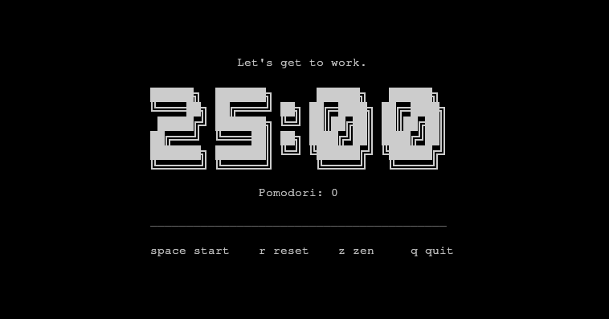

# TUIdoro

TUIdoro is a sleek pomodoro timer that runs in your terminal.



## Installation

### Via npx / bunx (requires bun > 1.3.0)

```bash
npx tuidoro (requires 'bun' to be in PATH)
bunx tuidoro
```

### Via AUR (contains Bun runtime (~100MB))

```bash
yay -S aur/tuidoro
```

### Run locally (requires bun > 1.3.0)

```bash
bun install
bun run build
./dist/tuidoro
```

## Configuration

The priority for reading the configuration is as follows:

1. `$TUIDORO_SETTINGS_PATH` environment variable
2. `~/.config/tuidoro/settings.json`

If the configuration file does not exist TUIdoro will launch with its [defaults](./config/settings.json).

## Contributing

Pull requests and issues are welcome! I do however plan on keeping this TUI as simple as possible.  
Feel free to fork this project and extend the TUI to fit your own personal needs.

## License

[MIT](./LICENSE)
